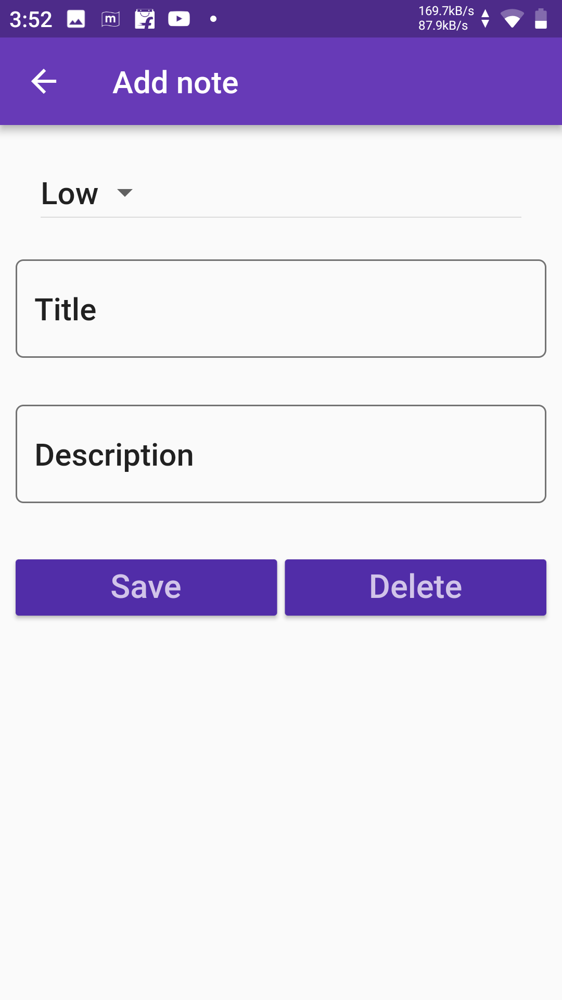
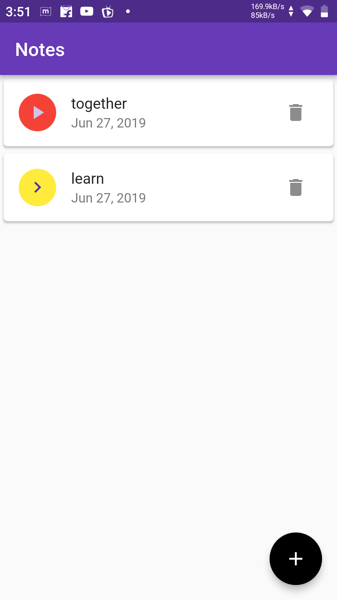

# Note Keeper

It is a basic project to store and display for keeping notes based on a Udemy tutorial. This project is made using [flutter framework](https://flutter.io) by google.

Best part of this freamework is that only one code base is sufficient for the development of Android,iOS,Web,and Desktop apps.

# Motive

My main motive for this project is to learn together since learning a new technology alone is quite boring thats why i would love if you guys folk it and add new things to it so that i to can learn from it.

I will share all the projects online that i will make while learning.

Post all the questions and advice in the issue's section

# #Let's Learn and Grow Together

# Screenshots
  

  

## Getting Started

This project is a starting point for a Flutter application.

A few resources to get you started if this is your first Flutter project:

- [Lab: Write your first Flutter app](https://flutter.io/docs/get-started/codelab)
- [Cookbook: Useful Flutter samples](https://flutter.io/docs/cookbook)
